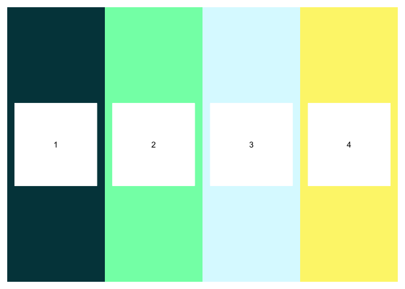
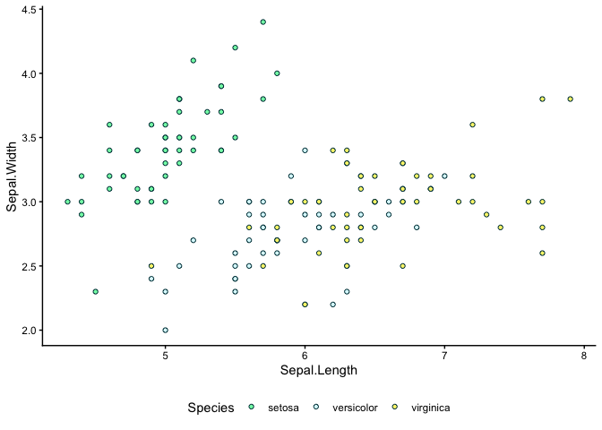
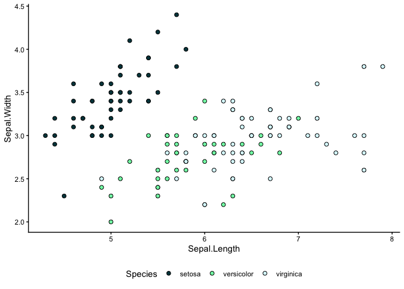

<!-- README.md is generated from README.Rmd. Please edit that file -->

# bioeconomyR

<!-- badges: start -->

<!-- badges: end -->

The goal of bioeconomyR is to provide easy access to BSI themed colours.

## Installation

You can install the development version of bioeconomyR from
[GitHub](https://github.com/) with:

``` r
# install.packages("pak")
pak::pak("orb16/bioeconomyR")
```

Or using devtools:

``` r
devtools::install_github("orb16/bioeconomyR")
```

## Example: manual palette use

This is a basic example which shows you how to use the palettes in a way
that is compatible with both base R and ggplot2

``` r
library(bioeconomyR)
library(ggplot2)
#> Warning: package 'ggplot2' was built under R version 4.5.2
## basic example code

head(iris)
#>   Sepal.Length Sepal.Width Petal.Length Petal.Width Species
#> 1          5.1         3.5          1.4         0.2  setosa
#> 2          4.9         3.0          1.4         0.2  setosa
#> 3          4.7         3.2          1.3         0.2  setosa
#> 4          4.6         3.1          1.5         0.2  setosa
#> 5          5.0         3.6          1.4         0.2  setosa
#> 6          5.4         3.9          1.7         0.4  setosa
unique(iris$Species)
#> [1] setosa     versicolor virginica 
#> Levels: setosa versicolor virginica
# 3 species. We will use the classic palette
bioeconomyR::print_pal("classic")
```



``` r


classicPal <- bioeconomyR::get_pal("classic")
ourCols <- classicPal[2:4] # just the light cols
ourCols
#> [1] "#80ffb4" "#dbfaff" "#fdf479"

ggplot(data = iris, aes(x = Sepal.Length, y = Sepal.Width)) + 
  geom_point(shape = 21, colour = classicPal[1], 
             aes(fill = Species)) +
  scale_fill_manual(values = ourCols) +
  theme_classic() + 
  theme(legend.position = "bottom")
```



## Example: ggplot2 specific

``` r

ggplot(iris, aes(Sepal.Length, Sepal.Width)) +
  geom_point(aes(fill = Species),
             colour = "black",
                      shape = 21, size = 2) +
  scale_fill_bsi("classic") +
  theme_classic() + 
  theme(legend.position = "bottom")
```


